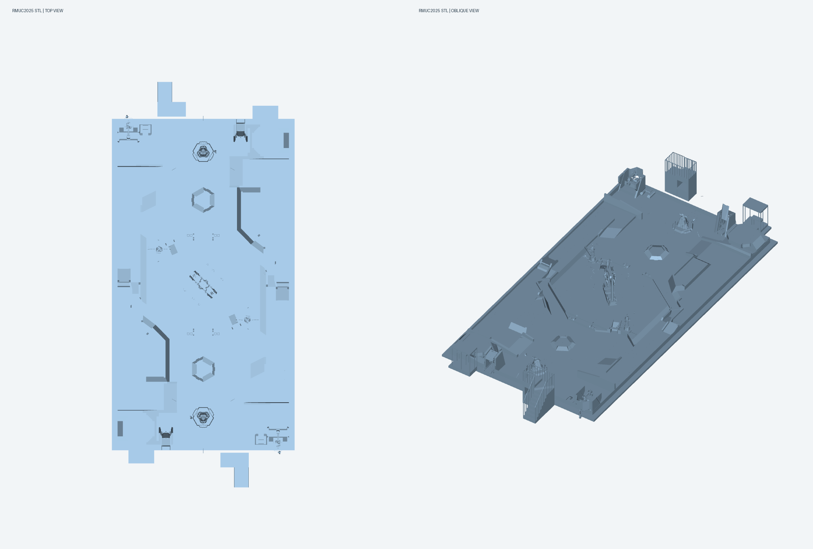
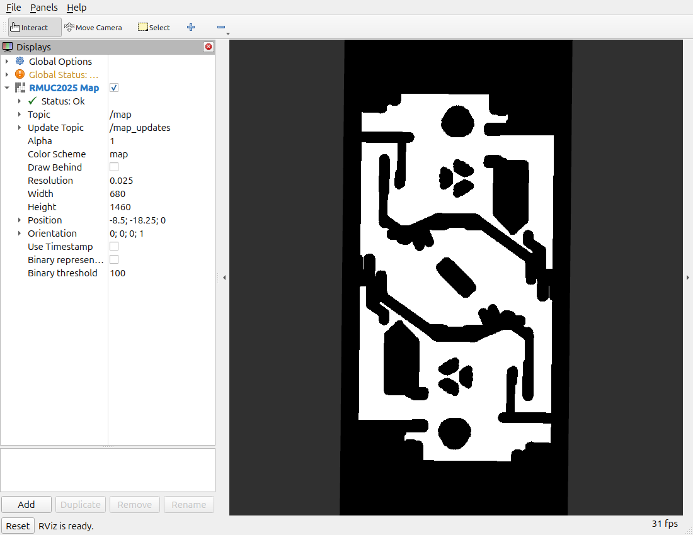
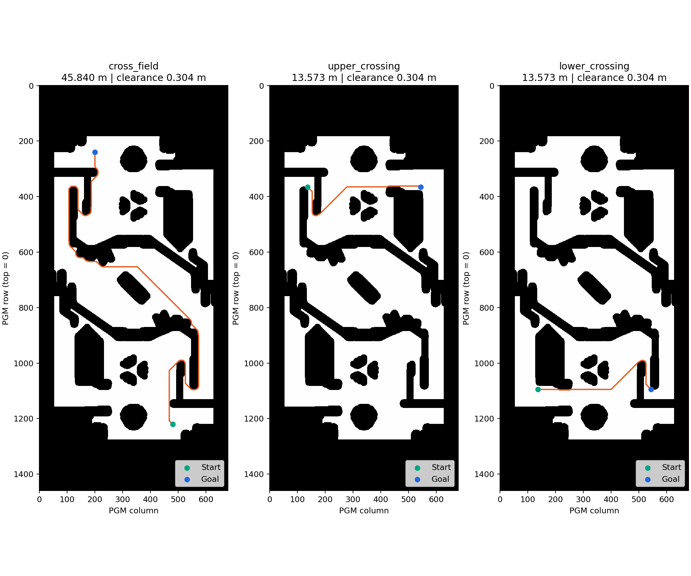

# SLAM 作业一：RMUC2025 三维模型转换为二维可通行地图

最终验证日期：2026-09-23。
运行环境：Ubuntu 24.04.4 LTS、ROS2 Jazzy、C++17。

## 1. 任务与输入模型

作业要求为：使用 RMUC2025 STL，编写 ROS2 二维栅格地图转换项目，输出根据机器人运动特性处理的 PGM 地图，并提交工作流程文档。示例图片仅作为展示参考，地图是否合理取决于输入模型和明确的通行假设。

本次输入为 `data/RMUC2025.STL`。现有元数据记录其由 `RMUC2025.stp` 导出，坐标变换为 `(x,y,z)=(X,-Z,Y)`，单位毫米；转换时乘以 0.001 得到米。STL 文件大小 389,472,984 字节，共 7,789,458 个三角面。重新计算的 STL SHA256 与原转换记录一致，详见 `模型来源说明.md`。




图 1：实际输入模型预览，左侧俯视、右侧斜视；颜色仅用于显示。模型包含场地地面、坡道、台面、围挡和其他立体结构。

## 2. 机器人假设与最终参数

机器人外接圆半径假设为 0.25 m，加 0.05 m 栅格/建模余量，使用 0.30 m 几何膨胀。高度假设为 0.60 m，最大支撑面坡度 25°，相邻格子允许高差 0.06 m。它们是可调整的设计假设，未被描述为课程指定数值或底盘实测能力。

| 参数 | 最终值 | 实际作用 |
|---|---|---|
| `resolution` | 0.025 m/格 | 二维离散精细度 |
| `robot_radius` | 0.30 m | 障碍外扩半径，包含假定车体尺寸和余量 |
| `scale` | 0.001 | 毫米转米 |
| `padding` | 0.50 m | 模型边界外的地图留边 |
| `terrain_mode` | true | 使用局部支撑面与地形通行筛选 |
| `require_ground` | true | 要求支撑面；地形模式本身也强制该条件 |
| `ground_tolerance` | 0.03 m | 支撑面最低高度容差 |
| `max_support_z` | 0.65 m | 支撑面相对模型原点的最大 Z，不是越障高度 |
| `max_slope_degrees` | 25° | 候选支撑面坡度阈值 |
| `max_step_height` | 0.06 m | 相邻格高差阈值，同时参与碰撞带下界判断 |
| `robot_height` | 0.60 m | 相对支撑面的垂直碰撞空间 |
| `frame_id` | map | 发布地图的坐标系 |

配置保留 `slice_min_z=0.05`、`slice_max_z=0.60`、`max_abs_normal_z=1.0`，但这些参数仅用于非地形模式，当前地形模式不以它们筛选障碍。详细配置见 `ros2_ws/src/stl_to_grid_map/config/rmuc2025.yaml`。

分辨率从旧版 0.05 改为 0.025 后，格子数量从 248,200 增加到 992,800，实际覆盖范围仍为 17×36.5 m。RViz 按米显示，因此全图形状不会整体放大；改善主要在边界离散精度。改变分辨率也会改变相邻支撑面采样，应重新验证路径，不能沿用旧结果。

## 3. 转换算法与工程组成

1. 读取 STL 三角面，检查输入与参数，按比例转换单位，计算二维边界和原点。
2. 在地形模式中按坡度和高度条件筛选支撑面，栅格化得到每格候选高度；同一格保留最高候选支撑面。
3. 检查支撑面上方的几何是否与机器人高度范围发生冲突；无支撑、碰撞或相邻高差超限的格子标为不可通行。
4. 按 0.30 m 欧氏半径膨胀障碍，得到机器人中心可通行区域。
5. 保留最大的四连通自由区域，避免封闭空腔或孤立台面被当作可达区域。该策略也可能去掉其他独立自由区域，是明确的算法取舍。
6. 写出二进制 PGM 和配套 YAML，并以 `nav_msgs/msg/OccupancyGrid` 每秒发布 `/map`。PGM 行从上到下，ROS 栅格按底部起始顺序填充，检查脚本已验证两者翻转后逐格一致。

`stl_grid_core` 是 C++ 核心库；`stl_to_grid_node` 是 ROS2 节点；`stl_to_grid_cli` 提供离线转换；`verify_map` 用 C++ A* 检查路径；Python 脚本只用于验证编排、独立审计和报告制图。A* 使用八邻域、直行/对角代价 10/14，禁止对角穿过障碍夹角；报告中的米制长度按每段实际欧氏距离累加，不将整数代价直接当作米。

## 4. 编译与运行流程

进入提交包根目录后：

```bash
bash build.sh
bash start.sh
bash verify.sh
```

`build.sh` 加载 Jazzy 环境，以 Release 模式编译，并运行 CTest。此前 ROS2 构建中的 CMake 链接语法混用已修复；本次构建和测试通过，记录见 `evidence/build_and_test.log`。

`start.sh` 启动节点与 RViz，使用包内 `config/slam_hw1.rviz`。Fixed Frame 为 `map`，Map Topic 为 `/map`，QoS 为 Reliable / Transient Local。启动脚本核对实际进程命令以避免 PID 重用误报。

修改参数后，执行 `bash stop.sh map` 再执行 `bash start.sh`；节点仅在启动时转换地图，不支持运行中参数变化自动重建。不要同时运行另一个同话题地图发布者。

## 5. ROS2 与 RViz 实际运行结果

| 检查项 | 本次结果 |
|---|---|
| ROS 节点 | `stl_to_grid_map` |
| 地图话题 | `/map`，类型 `nav_msgs/msg/OccupancyGrid` |
| 地图分辨率 | 0.025 m/格（ROS float32 读数约 0.02500000037） |
| 地图尺寸 | 680×1460，共 992,800 格 |
| 地图原点 | (-8.5, -18.25, 0) m |
| 自由格 / 占用格 | 392,604 / 600,196 |
| 发布情况 | 唯一地图发布者；连续收到至少两帧，时间戳递增，间隔约 1 s |
| 文件与话题一致性 | 分辨率、尺寸、原点与逐格占用数据全部一致 |
| RViz | 已订阅并显示地图，Map 显示项 `Status: Ok` |



图 2：直接截取实际 RViz 窗口，左栏可见 Resolution 0.025、Width 680、Height 1460 和 Map Status: Ok。截图保留了 Global Status 的警告标志，本作业未提供完整机器人 TF/导航系统，报告不将该截图描述为所有 RViz 检查均通过。当前地图可正常显示。该截图不是离线制图或合成效果图。

机器记录见 `evidence/runtime_check.json`、`runtime_check.txt`、`node_parameters.yaml` 和 `map_topic_info.txt`。`check_map.py` 已取消旧版 340×730 与 0.05 的固定断言，改为读取参数文件和实际 PGM/YAML，并验证实时数据。

## 6. 新版地图路径通行验证

使用与最终地图相同的 ROS 参数文件，仅将 `robot_radius` 覆盖为 0，生成 `RMUC2025_raw.pgm`。该零膨胀图仍经过支撑面、碰撞、坡度/台阶和连通域筛选。临时转换节点使用独立 DDS 域 91，不向 RViz 当前 `/map` 注入数据。

三条路径均由提交包中的 C++ `verify_map` 实际计算，Python 随后独立检查端点、每格自由状态、相邻移动合法性、禁止斜向穿墙、欧氏长度，并以整张零膨胀图的欧氏距离变换复核最近障碍格中心距离。

| 测试 | 起点 → 终点（PGM 列、行） | 路径点数 | 实测长度 | 最小障碍格中心距离 |
|---|---|---:|---:|---:|
| 跨场地 | (480,1220) → (200,240) | 1642 | 45.840233 m | 0.304138 m |
| 上部横向 | (136,365) → (544,365) | 488 | 13.572971 m | 0.304138 m |
| 下部横向 | (136,1095) → (544,1095) | 488 | 13.572971 m | 0.304138 m |

跨场地端点沿用旧测试位置的分辨率缩放，位于场地两端。上下横向端点取对应区域中的自由格（脚本会寻找距指定目标像素最近的自由格）。全部测试结果为 PASS，未发现占用格穿越和对角穿墙。



图 3：绿色为起点，蓝色为终点，橙色为实际计算的路径。横纵坐标采用 PGM 图像列、行，行号从上向下增加。

此处 0.304138 m 是到**零膨胀地图障碍格中心**的距离，不能等同于真实障碍表面或车体边缘的净空。它验证了离散膨胀和路径约束，尚不涵盖栅格边界误差、动力学和实车误差。路径不存在时程序将报失败，不以绘制线条替代实际寻路。

路径 CSV、C++ 原始日志及独立审计结果分别见 `output/path_*.csv`、`evidence/*cross*.log` 和 `evidence/path_validation.json`。旧版 46.5756 m、836 个路径点的结果不再用于本次验收。


